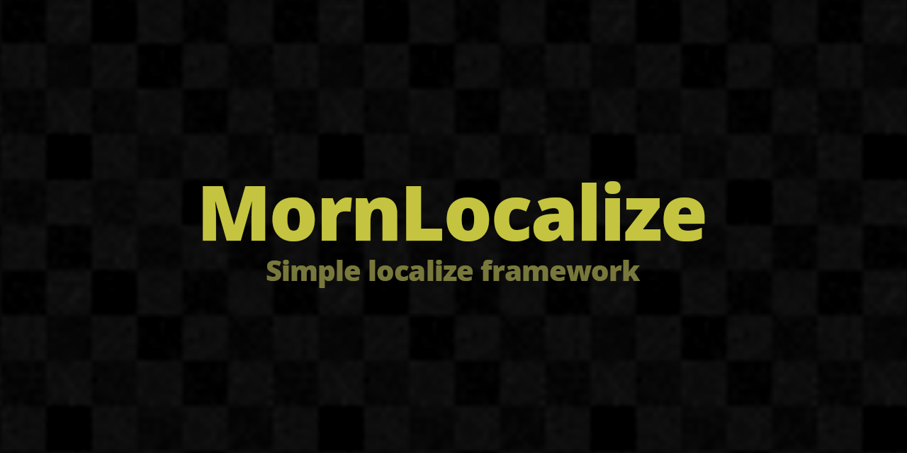

# MornLocalize

<p align="center">
  
</p>

<p align="center">
  
</p>

## 概要

Unity 向けの簡単に使えるローカライズフレームワーク。Google Sheets を使ったマスターデータ管理、テキスト / スプライト / 画像の動的切り替えに対応。

## 導入方法

Unity Package Manager で以下の Git URL を追加:

```
https://github.com/TsukumiStudio/MornLocalize.git?path=src#1.0.0
```

`Window > Package Manager > + > Add package from git URL...` に貼り付けてください。

### 依存パッケージ

- [UniRx](https://github.com/neuecc/UniRx) (`com.neuecc.unirx`)
- [UniTask](https://github.com/Cysharp/UniTask) (`com.cysharp.unitask`)
- [TextMeshPro](https://docs.unity3d.com/Packages/com.unity.textmeshpro@latest) (`com.unity.textmeshpro`)
- [MornGlobal](https://github.com/TsukumiStudio/MornGlobal) (`com.tsukumistudio.mornglobal`)
- [MornDebug](https://github.com/TsukumiStudio/MornDebug) (`com.tsukumistudio.morndebug`)
- [MornSpreadSheet](https://github.com/TsukumiStudio/MornSpreadSheet) (`com.tsukumistudio.mornspreadsheet`)

## ライセンス

[The Unlicense](LICENSE)
